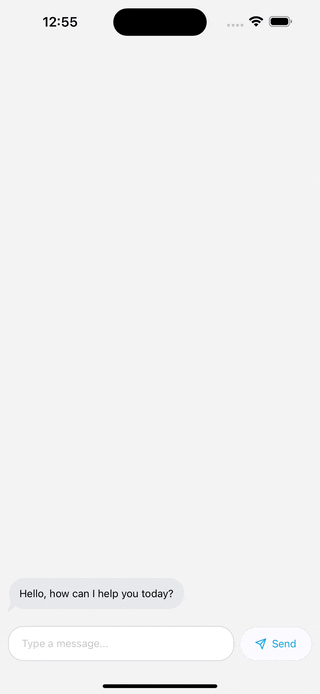

# AI Weather Chat (react-native-gen-ui example)

This repository serves as an example usage of the open-source React Native package called `react-native-gen-ui`. The package facilitates the integration of AI chat capabilities into React Native applications. In this example, we demonstrate how to effectively utilize the tools provided by `react-native-gen-ui` to obtain the user's location and fetch weather information based on that location.

## Features

- Integration of AI chat functionality
- Retrieval of user's location
- Fetching weather information based on the user's location

## Usage

To run the example application:

1. Clone this repository to your local machine.
2. Navigate to the root directory of the cloned repository.
3. Install dependencies using `npm install` or `yarn install`.
4. Ensure you have the necessary environment variables set up, including `EXPO_PUBLIC_OPENAI_API_KEY` and `EXPO_PUBLIC_OPENAI_MODEL`.
5. Run the application using `expo start`.

## Code Overview

The main code of the application can be found in the `App.js` file. Here's a brief overview of its functionality:

- Initialization of `OpenAI` instance with appropriate API key and model.
- Integration of chat functionality using `useChat` hook provided by `react-native-gen-ui`.
- Implementation of tools for obtaining location and fetching weather data.
- Rendering of chat interface with message components and user input field.

## Dependencies

This example application relies on the following dependencies:

- `react-native-gen-ui`: Open-source React Native package for integrating AI chat functionality.
- `expo-location`: For accessing device location information.
- `zod`: For parameter validation in tool implementations.
- Other dependencies for UI components and utilities.

## Resources

- [Original `react-native-gen-ui` Repository](https://github.com/zerodays/react-native-gen-ui): Link to the original library package repository.
- [`react-native-gen-ui` on npm](https://www.npmjs.com/package/react-native-gen-ui): npm package link for `react-native-gen-ui`.

## License

This example application is licensed under the [MIT License](LICENSE).

---

Feel free to explore the code and adapt it to suit your needs! If you encounter any issues or have suggestions for improvements, please don't hesitate to open an issue or submit a pull request.